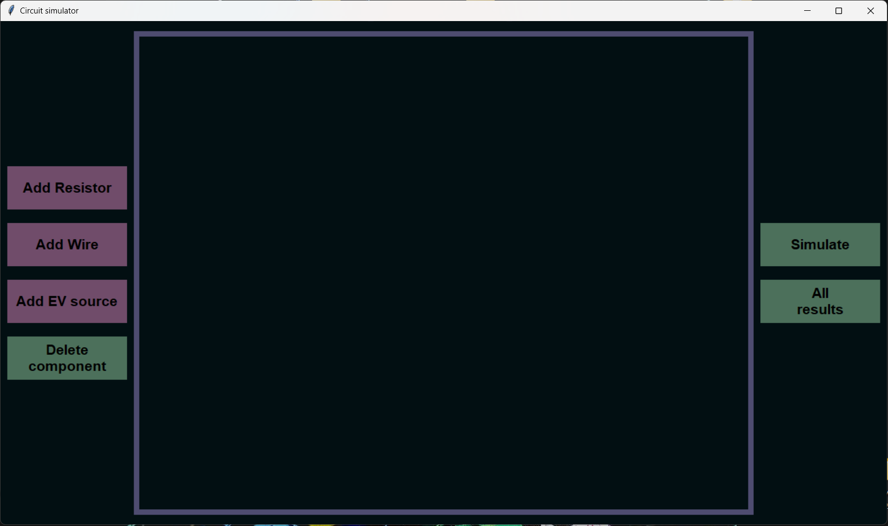
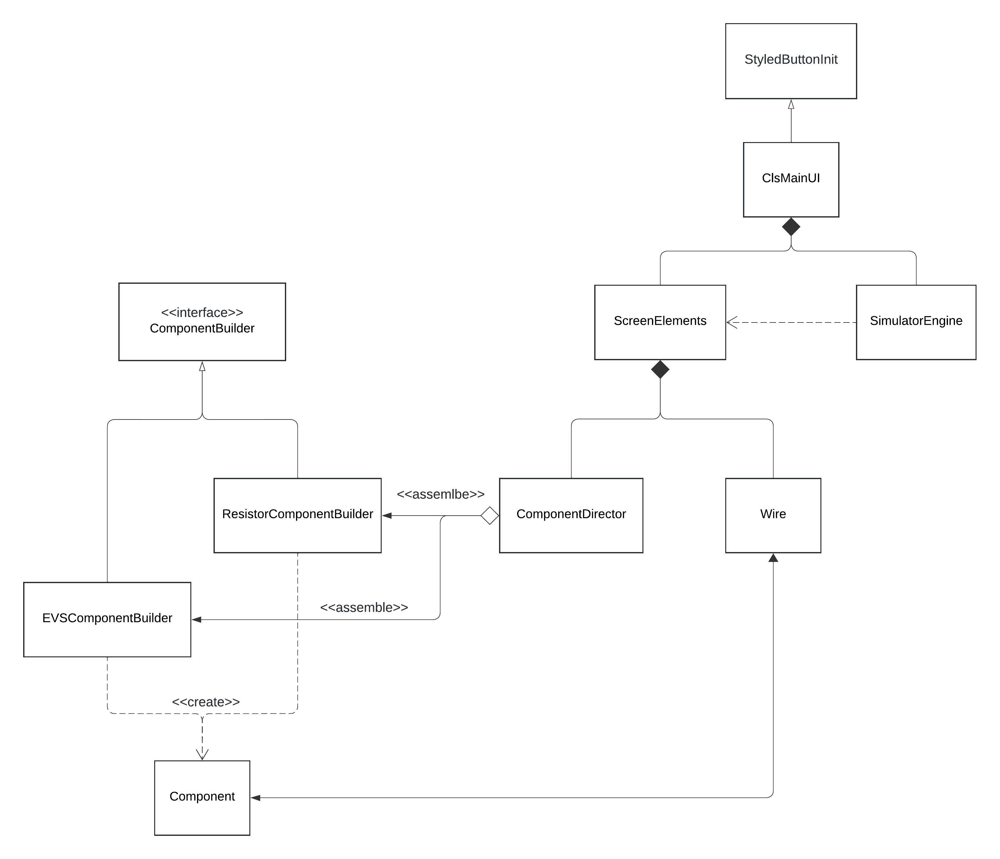

# Electronic circuit simulator

## Introduction

- Goal of course work
    - First of all, the main goal of the course work was to challenge myself and to create a complex application that would test my programming skills.
    - The secondary goal was to create simulator that would be useful in practice.
    - The final goal was to apply the knowledge learnt in the course of OOP.
- Topic description
    - The topic ‘Electronic circuit simulator’ refers to an application designed to test and simulate basic electronic circuits. The simulator program allows to model simple circuits in the interactive UI by adding and modifying the components and their parameters. Parameters such as: series current and component voltage can be calculated. Simulators are used widely in the electronics engineering field.
- What is the application ?
    - The application is a circuit simulator and a simple CAD program that can draw components on the screen, allow the user to interact with them and complete basic calculations of the circuit parameters - series current, component voltages. Also the program draws a potential diagram.
    
    
    
    The main screen of the application
    
- How to run the program ?
    - The application requires to external libraries which can be installed by:
        
        ```python
        pip install tkinter
        pip install matplotlib
        ```
        
    - The program is started from the main file by using extensions or simply form the command line.
- How to use the program ?
    - The program consists of an interactive UI, that allows to insert two basic components: Resistors and EV sources (power supplies). The canvas area allows the components to be dragged and connected by wire, which at the moment serves more of a visualization purpose because of the program complexity and the alpha state of the simulator class.
    - After placing the components their parameters can be modified by double clicking on the component. As mentioned before, it is not mandatory to connect the components as the simulator only simulates ‘series’ circuits.
        - ‘Series’ circuit - a circuit that consists of a single chain of components connected one after the other.
    - After clicking the ‘simulate’ button the results are displayed in a new window and are automatically saved to a txt file. Also the simulator draws a potential diagram that is saved as a .png file.
    - There is also the ability to view past simulation results by clicking the button in the UI or directly opening the .txt file that is saved in the program folder.

## Body/Analysis

Analysis and explanation of the program's implementation.

- The program consists of two files:
    - main.py
        - Stores the main implementation
    - component_cls_constants.py
        - Stores classes that contain constants used in the application. This is mandatory, because the drawn components have various dimensions, sizes and default text and values.
- Libraries:
    - The application is written using tkinter - a library that allows creation of a simple ui interface that can have various widgets like: buttons, canvas (draw shapes), spinners, lists etc.
        - tkinter works in a modular - hierarchal principle. The main component, that creates the program window is instantized from the Tk() class. Then every new component such as: buttons, layout frames and etc. are created as children of the main window (They are aggregated to the main window object during their instantization).
    - os is used for creating a directory for saved images.
    - math is used to simplify calculations used in wire class - specifically to calculate click distance from a specified point
    - pyplot is used for creation of the potential diagram
    - abstract class implementation is imported from the standard python module abc
- Class diagram:
    
    
    
- Class description and function
    - StyledButtonInit()
        - This class serves a simple function - to reduce code repeats and store the default styles of buttons. The style dictionaries can be easily modified or expanded if different colors and styles are needed.
        - The class replaces the default tkinter button class when an object is being instantized:
            
            ```python
            add_resistor_button = StyledButtonInit(
                        self.subgrid1, 
                        text="Add Resistor",
                        style='purplestyle',
                        command=self.screenElements.add_resistor)
                    add_resistor_button.grid(column = 0, row = 0, padx = 10, pady = 10)
            ```
            
            - Component parameters are then passed as usual with an additional style atribute. In its constructor the StyledButtonInit() object calls the super class construction (cls tk.Button) which in turn creates the desired button with the default styles.
    - ClsMainUI()
        - This is the main class of the program, which is used as a simple abstraction to decomplicate the order of the program class object instantization and setup of the tkinter UI window and its elements.
            - Class methods:
                - initMainWindow - creates the main tkinter window object
                - setupMainWindowComponents - creates girds for aligning UI components, creates the canvas object which draws all interactable components
                - initMainSimulatorCls - creates ScreenElements and SimulatorEngine objects. Also uses dependency injection by linking these objects with the observer design pattern.
                - setupButtonListeners - creates button objects and links the desired methods to be called when the buttons are pressed.
                - runUI - runs the tkinter main window loop.
    - ScreenElements()
        - This is the main class that manages the main objects that are created from the wire and component classes.
        - The class stores lists of created resistor, wire and evsource objects to be managed and passed to various objects that require component parameters.
        - the class has 3 methods (add_resistor, add_ev_source, add_wire) for creating canvas objects and ensuring their count limit isn’t reached. These methods are called as the UI add buttons are clicked.
        - The two observer methods are used to link ScreenElements to the SimulatorEngine object and update the list of component objects in the SimulatorEngine as new components are added.
            
            ```python
            def add_observer(self, observer):
                    if observer not in self.observers:
                        self.observers.append(observer)
            
                def observer_notify(self):
                    for observer in self.observers:
                        observer.updateComponentLists(self.resistors, self.evsources)
            ```
            
        - display_short_message, display_short_message_destroy - are legacy methods that where left for refactoring and new functionality to be added as the messagebox module from tkinter covers their functionality.
        - open_delete_component_window and  delete_component methods are yet to be implemented.
    - SimulatorEngine()
        - This class is used for calculating and determining the circuit component voltages and current. The class also implements drawing of the potential diagram. The class handles saving and writing the results to file.
        - updateComponentLists - the method called from ScreenElements when new components are added. The component lists are updated.
            
            ```python
            def updateComponentLists(self, resistors, evsources):
                    self.resistors = resistors
                    self.evsources = evsources
            ```
            
        - basic_series_simulation_start
            - This method checks for a complete circuit and calls methods that handle the simulation.
        - complete_basic_series_simulation
            - This method has the main implementation for calculating series voltages and current. The resistor and evsource component parameters are retrieved from their complementary objects and are named.
            - The calculations are based on Omh’s law for an isolated part of a circuit described in this equation:
                - $I=\displaystyle\frac{\sum E+U_{ab}}{R_{ab}}$
                    - Where E - is the sum of all evsources, I is the closed contour circuit current, Uab is the voltage drop across a part of a circuit and the Rab is the resistance of the whole contour.
            - The component parameter lists are used to complete the calculations and the result lists are passed on to other methods to be displayed and saved.
        - draw_potential_diagram
            - This method uses the pyplot library to plot the potential diagram and save it to a folder in the program directory. The file is named after the date it was created on.
        - show_complete_basic_series_simulation_results
            - This method opens a new window by creating a Toplevel() class object which stores all of the new window components. In there there PhotoImage and Label objects are created and both display the results of the simulation - the component voltages, current and the potential diagram
        - save_results_txt
            - Saves the list of results to a .txt file.
        - load_results_from_txt
            - Opens a new window and displays the .txt file contents. The window opening is implemented again with the Toplevel class from the tkinter library.
    - Builder design pattern classes:
        
        The listed classes are the core part of the program. As the constructor of Component() is huge in the number of parameters it receives an has to setup, it was chosen to apply the builder design pattern as the complex Component() also has to have variances in its construction - it has to be a resistor or an evsource (different size, shape, parameter type and so on). The main movement and modification implementation doesn’t have to change and is left untouched in the Component() class. 
        
        - ComponentBuilder()
            - Interface class. An abstract class that has all of the Component() method names that build the objects constructor.
        - EVSComponentBuilder()
            - A builder class that implements all of the interface methods that are specific to an evsource.
        - ResistorComponentBuilder()
            - A builder class that implements all of the interface methods that are specific to a resistor.
        - ComponentDirector()
            - The class which implements the correct order of execution for the implemented EVSComponentBuilder or ResistorComponentBuilder. The methods are applied specifically depending on which object type is required.
        - Component()
            
            The complex object. This class implements the main elements that a component on the canvas has to have. Class methods:
            
            - __init__
                - As the construction of Component is handled, it has to be mentioned that there are special listeners that are created for the component’s body. They are what call most of the class methods when the objects is interacted with on the canvas.
            - offset_coordinates
                - A method that applies default coordinate origin points for the element contacts and text when they are redrawn when moved.
            - on_click
                - Simply saves the coordinates of where the user clicked on an object.
                - It serves an important role in optimizing the dragging of the component. As the user doesn’t click directly on the objects origin coordinates the component has to be offset, so the body of the component doesn’t jump around.
            - on_drag
                - A method that gets called by listeners when the object is dragged on the screen. It redraws the body, contacts and text of the component.
                - The method also calls a method to move the connected wires.
            - handle_connected_wire_move
                - As the component can have wires connected to its contacts, this method redraws the wires correctly when the component is moved.
                - It checks in what way the wire is drawn on the component (starts/ends) so the wire isn’t redrawn flipped.
            - on_double_click
                - The method that implements the opening the the setup of the component parameter modification window. Again the window is created using the Toplevel class.
            - handle_mod_menu_close
                - The method that gets called when the modification window is closed. It saves the modified or not modified component parameters and updates the component name.
            - handle_component_delete
                - Not yet implemented
            - return_component_value
                - Returns the component value - encapsulation
            - return_component_name
                - Return the component full name - encapsulation
    - Wire()
        
        The main class that handles the drawing and handling of wires being drawn on the canvas.
        
        - __init__
            - As this class differs a lot from the Component class, the builder pattern isn’t used here. But the constructor remains similar. The most important part of the constructor is again the listeners that call the class methods when the canvas is click (wire is trying to be drawn)
        - check_if_contact
            - The method is called when the canvas is clicked. It is primarily utilized to check if the wire can be started of finished on the place where the user clicked - simply if the clicked place is a contact point for a component.
            - It does so by retrieving the contact coordinates and calculating the click distance to the nearest one, if a contact is near, the method calls to start or finish a wire draw.
        - link_contact_to_wire
            - This method is used to aggregate the wire to a object to which it was linked.
        - start_wire_draw
            - A method that initializes the drawing of the wire. It draws the first line of the wire from the contact to the mouse position.
        - finish_wire_draw
            - Finishes the drawing process. Draws the final position of the wire and closes the click listeners so recourses are conserved.
        - mouse_moved
            - The method which redraws the wire to follow the mouse when a wire is being drawn.
        - handle_wire_delete
            - Yet to be implemented.

### Functional requirements

As the program implements the listed requirements multiple times across the whole application, single examples will be given and expanded if needed in the presentation.

- 4 OOP pillars
    - Polymorphism
        - One of the most used concepts in the application. The tkinter library objects obey to the same method while being drawn but the exact implementation of the tkinter object differs completely. For example:
            
            ```python
            self.subgrid2 = tk.Frame(self.main_grid, bg=ClsMainUI.main_back_c)
            self.subgrid2.grid(column=2, row=0)
            
            self.canvas = tk.Canvas(self.main_grid, width=900, height=700, bg=ClsMainUI.main_back_c, highlightbackground='#4e4c70', highlightthickness=8)
            self.canvas.grid(column = 1, row = 0)
            # There are 2 completely different objects: subgrid - which is a container
            # for other objects that are drawn on the screen and a canvas - which is a
            # place where anything can be drawn on the screen (shapes, components)
            # But both objects react the same to the call of .grid method, which displays
            # the components in the specified spots on the screen.
            ```
            
    - Abstraction
        - Also a widely used concept in the application. The program has many levels of abstraction. For example:
            - The highest level of abstraction can be observed in the main loop:
                
                ```python
                def main():
                    mainProgram = ClsMainUI()
                    mainProgram.initMainWindow()
                    mainProgram.setupMainWindowComponents()
                    mainProgram.initMainSimulatorCls()
                    mainProgram.setupButtonListeners()
                    mainProgram.runUI()
                ```
                
                - The simulator user doesn’t need to know how the main window initialization is done or what classes govern the simulation and drawing of the components.
            - The abstraction principle is used in mostly in all classes of the application.
    - Inheritance
        - A less commonly used concept in this application. As the program mostly depends on aggregation or composition type relationships. But a few examples:
            
            ```python
            class StyledButtonInit(tk.Button):
            	# implementation
            class ClsMainUI(StyledButtonInit):
            	# implementation
            ```
            
            - As described before the StyledButtonInit class inherits from the tkinter library’s class Button() to modify and override the constructor of the Button() class so default styles of the buttons can be more easily created without creating code duplication.
            - Also the ClsMainUI inherits from the StyledButtonInit class as it stores some default color variables.
    - Encapsulation
        - Also a less widely used concept. A few examples can be observed:
            
            ```python
            class Component():
            # Other cls methods ****
            # 
            # Other cls methods ****
                def return_component_value(self):
                    return self.value
            
                def return_component_name(self):
                    return f"{self.name}{self._id}"
            ```
            
            - Other parts of the program need to get the component value (to be used in the simulation) or get the component name (to display it on screen). The Component() class implements this without exposing the inner attributes of its objects via a function that gets and returns the required variables.

### Design patterns

- Builder
    - Was discussed in the class description.
    - To summarize the builder pattern was chosen to create the complex object of Component(). The decision was made because of the huge constructor of the Component() class and because it has to differ according to what component is being created.
- Observer
    - The pattern was applied to SimulatorEngine and ScreenElements class. It serves a function to link the simulatorEngine object to the screenElements object so the simulator engine keeps up to date if new components are added on the screen by the user.
        - Linking phase:
            
            ```python
            def initMainSimulatorCls(self):
                self.screenElements = ScreenElements(self.window, self.main_grid, self.canvas) # window ir canvas perduodami, kad visi objektai zinotu, kur piesti viska reikia
                self.simulatorEngine = SimulatorEngine(self.window) 
                self.screenElements.add_observer(self.simulatorEngine)
            ```
            
        - Linker implementation:
            
            ```python
            # The objects are aggregated
            def add_observer(self, observer):
                    if observer not in self.observers:
                        self.observers.append(observer)
            
            # The method to be called when a new resistor or evsoure is added
            # Updates the SimulatorEngine component lists.
                def observer_notify(self):
                    for observer in self.observers:
                        observer.updateComponentLists(self.resistors, self.evsources)
            ```
            
        - Update implementation:
            
            ```python
            def updateComponentLists(self, resistors, evsources):
                self.resistors = resistors
                self.evsources = evsources
            ```
            

### Reading from file & writing to file

- The saving to file was implemented in two ways:
    1. Saving the png image of the potential diagram
        
        ```python
        #The current time is saved as a string
        now = datetime.now()
        time_string = now.strftime("%Y%m%d_%H%M%S")
        
        # The directory names are created
        path_name = "Kursinis_darbas/Simulation_results/"
        image_name = f"{path_name}potential_diagram{time_string}.png"
        
        # If the directory doesnt exist, it is created
        if not os.path.exists(path_name):
            os.makedirs(path_name)
        
        # The diagram is saved as a png
        plt.savefig(image_name)
        ```
        
    2. Saving the results of the simulation to a txt file
        
        ```python
        def save_results_txt(self, mainvoltage, circuit_current, resistor_voltages):
            # Directory name
            path_name = "Kursinis_darbas/Simulation_results/"
            
            # If the directory doesnt exist, it is created
            if not os.path.exists(path_name):
                os.makedirs(path_name)
        
        		#The current time is saved as a string
            now = datetime.now()
            time_string = now.strftime("%Y%m%d_%H%M%S")
        
        		# The file is opened in append, if it doesnt exist, it is created. 
            with open(f"{path_name}Simulation_results.txt", 'a') as file:
                # The simulation time is written in the file
                file.write(f"Simulation time: {time_string}| ")
        
                # The circuit current and voltage is saved
                file.write(f"Circuit voltage: {mainvoltage:.7f} V |")
                file.write(f"Circuit current: {circuit_current:.7f} A |")
        
        				# The resistor voltages are save
                for name, voltage in resistor_voltages:
                    file.write(f"{name}: {voltage:.7f} V|")
        
        				# A new line is generated
                file.write("\n")
        ```
        
    3. read txt - Past results
        
        ```python
        def load_results_from_txt(self):
            path_name = "Kursinis_darbas/Simulation_results/"
        
        		# Exeption handeling for cases if file is not found.
            try:
                with open(f"{path_name}Simulation_results.txt", 'r') as file:
                    file_read_text = file.read()
                
                # A new window is created to dispay the results
                results_window = tk.Toplevel(self.window)
                results_window.title("Past simulation results")
                results_window.geometry("600x400") 
        
                # For better readability if there is a lot of text a scroll bar is added
                scrollbar = tk.Scrollbar(results_window)
                scrollbar.pack(side='right', fill='y')
        
                # The text field for displaying the text is created
                content_text = tk.Text(results_window, wrap='word', yscrollcommand=scrollbar.set)
                content_text.insert('1.0', file_read_text)
                content_text['state'] = 'disabled' # So the user cannot modify the text
                content_text.pack(expand=True, fill='both')
        
                # Further configuration of the scroll bar
                scrollbar.config(command=content_text.yview)
        
        		# Exception if file was not found. A message box displays the text.
            except FileNotFoundError:
                messagebox.showerror("Error", "File was not found")
        
        		# Exception if an other error occured. A message box displays the text.
            except Exception as e:
                messagebox.showerror("Error", f"An error occurred: {e}")
        ```
        

## Results and Summary

1. The main objectives of the course work where reached and the specified functional requirements where realized.
2. The most challenging part was the creation of the wire class which has the most complex behavior and function in the code. Also it can be improved upon by implementing various handlers that would make wire drawing more easier to understand and maintain.
3.  The components where designed in such a way that a more complex simulation could be created as the component class doesn’t have to change.
4. All in all, the course work was a success.